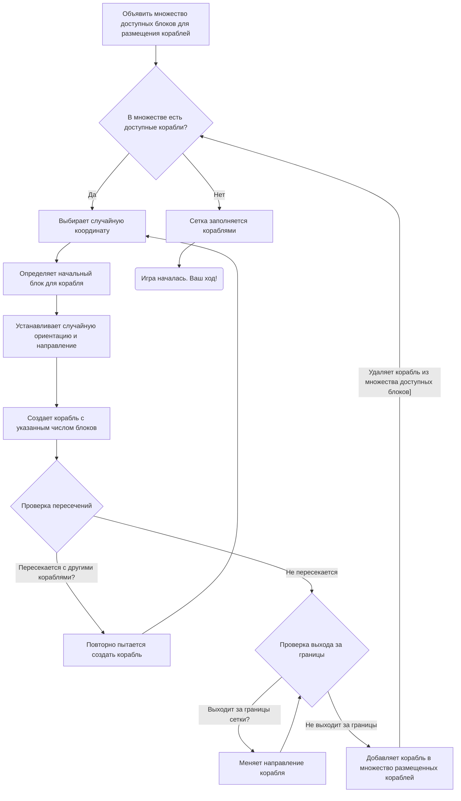
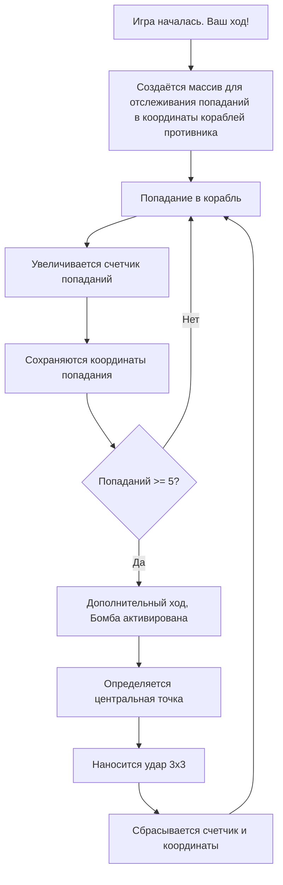

# Поведенческие модели
## Диаграмма состояний для автоматического расставления кораблей

**Описание:**
В начале определяется множество доступных блоков для размещения кораблей. Проверяется имеются ли доступные корабли:
   - Если да, программа выбирает случайную координату и определяет начальный блок для корабля, устанавливая случайную ориентацию и направление. После этого создает корабль с указанным числом блоков. После размещения корабля происходит проверка: 
      - Если корабль пересекается с другими кораблями, программа повторно пытается создать корабль.
      - Если корабль выходит за границы сетки, программа меняет направление корабля.
      - Если всё верно: корабль добавляется в множество координат уже размещенных кораблей и корабль удаляется из множества кораблей доступных блоков.
   - Если нет, программа заполняется сетку кораблями и выдаёт сообщение "Игра началась. Ваш ход!"
## Диаграмма бомбы

**Описание:**
В начале игры создаётся массив для отслеживания попаданий в координаты кораблей противника. Бомба есть только у игрока и активируется она после 5 попаданий в координаты кораблей противника. После активации бомбы пользователь видит сообщение "Дополнительный ход, Бомба активировна". Игрок нажимает на координату выстрела бомбы  и бомба, размером 3x3 поражает поле противника.
## Диаграммы хода компьютера
### Диаграмма первого выстрела

### Диаграмма неудачного предыдущего хода

### Диаграмма затонувших кораблей

### Диаграмма раненных кораблей

**Описание:**
Процесс начинается с проверки успешности предыдущего выстрела.
   - Если выстрел был успешным и корабль добавлен в множество затонувших, то определяется новая случайная координата для следующего выстрела. Затем проверяется успешность следующего выстрела:
      - Если он попал в корабль, то обновляется состояние игрового поля и принимаются соответствующие действия (добавление координат корабля в список поврежденных или затонувших).
      - Если выстрел не попал, то ход переходит к игроку.
   - Если выстрел был успешным, но корабль не добавлен в множество затонувших, то происходит проверка определено ли направление атаки, компьютер стреляет в текущем направлении. Процесс повторяется до тех пор, пока не будет определено направление атаки.
      - В случае успешного выстрела компьютер продолжает атаковать в том же направлении.
      - Иначе меняет направление или переходит к ходу игрока.
        
Диаграмма также показывает возможность дополнительного хода после успешного выстрела.
## Диаграмма последовательности

**Описание:**
Игра начинается с размещения кораблей, после чего игрок и компьютер поочередно делают ходы, стреляя по координатам на поле противника. Если попадание подтверждается, состояние игры обновляется, и игрок получает дополнительный ход. Помимо этого, если у игрока активирована бомба, он может использовать ее для атаки области 3x3. Игра продолжается до тех пор, пока не будут потоплены все корабли одного из игроков.

