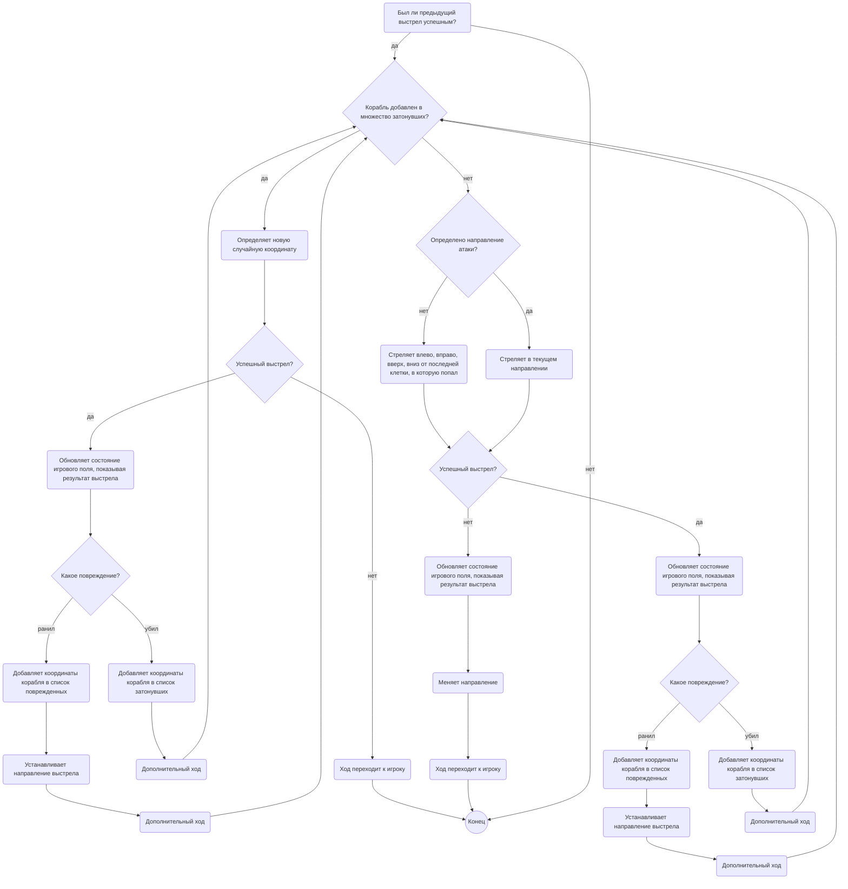

```mermaid
flowchart TD
    A(Был ли предыдущий выстрел успешным?) -- да --> B{Корабль добавлен в множество затонувших?}
    
    B -- да --> C(Определяет новую случайную координату)
    C --> D{Успешный выстрел?}
    
    D -- да --> E(Обновляет состояние игрового поля, показывая результат выстрела)
    E --> F{Какое повреждение?}
    
    F -- ранил --> G(Добавляет координаты корабля в список поврежденных)
    G --> H(Устанавливает направление выстрела)
    H --> I("Дополнительный ход")
    
    I --> B
    
    F -- убил --> J(Добавляет координаты корабля в список затонувших)
    J --> K("Дополнительный ход")
    
    K --> B
    
    D -- нет --> L(Ход переходит к игроку)
    L --> M((Конец))

    B -- нет --> N{Определено направление атаки?}
    N -- нет --> O(Стреляет влево, вправо, вверх, вниз от последней клетки, в которую попал)
    N -- да --> P(Стреляет в текущем направлении)
    
    O --> Q{Успешный выстрел?}
    P --> Q
    
    Q -- да --> R(Обновляет состояние игрового поля, показывая результат выстрела)
    R --> S{Какое повреждение?}
    
    S -- ранил --> T(Добавляет координаты корабля в список поврежденных)
    T --> U(Устанавливает направление выстрела)
    U --> V("Дополнительный ход")
    
    V --> B
    
    S -- убил --> W(Добавляет координаты корабля в список затонувших)
    W --> X("Дополнительный ход")
    
    X --> B
    
    Q -- нет --> Y(Обновляет состояние игрового поля, показывая результат выстрела)
    Y --> Z(Меняет направление)
    Z --> AA(Ход переходит к игроку)
    AA --> M((Конец))

    A -- нет --> M((Конец))
```